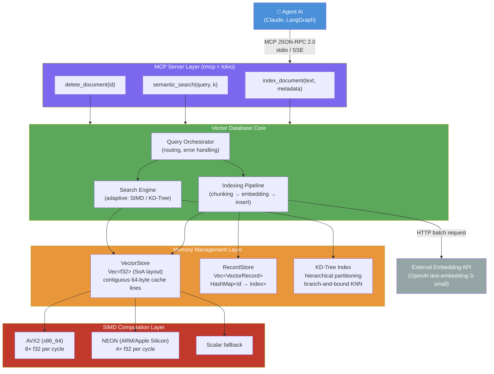

# Dokument wizji projektu

**Nazwa projektu:** NanoVec — lekka, pamięciowa baza danych wektorowych dla agentów AI

---

## 1. Executive Summary

NanoVec to lekka, bezwygodowa baza danych wektorowych napisana w języku Rust, działająca wyłącznie w pamięci operacyjnej i przeznaczona do obsługi tymczasowych cykli rozumowania autonomicznych agentów AI. Istniejące rozwiązania (Pinecone, Milvus, Qdrant) są zaprojektowane z myślą o trwałym przechowywaniu danych, co generuje niepotrzebne opóźnienia sieciowe, złożoność operacyjną i problemy z prywatnością w kontekście sesji AI. NanoVec rozwiązuje ten problem oferując architekturę RAM-only z natywną integracją z protokołem MCP (Model Context Protocol), co eliminuje narzut sieciowy i infrastrukturalny. Grupą docelową są programiści budujący agentyczne przepływy pracy AI. Główną wartością jest latencja poniżej 1 ms wobec 10–100 ms dla rozwiązań chmurowych. Ryzyka obejmują ograniczenia algorytmu KD-Tree w przestrzeniach wysokowymiarowych (768+ wymiarów) oraz brak trwałości danych jako celowe ograniczenie projektowe.

---

## 2. Cel i grupa docelowa

### Problem

Współczesne systemy AI ewoluują od statycznych asystentów konwersacyjnych w kierunku autonomicznych agentów wieloetapowych. Wymagają one dynamicznego zarządzania pamięcią roboczą podczas trwania sesji: indeksowania dokumentów w locie, semantycznego przeszukiwania kontekstu i natychmiastowego zapominania danych po zakończeniu zadania. Istniejące bazy wektorowe (Pinecone, Milvus, Qdrant) zostały zaprojektowane jako systemy trwałe, klastrowalne i dostępne przez sieć — cechy te są zbędne lub wręcz szkodliwe dla efemerycznych potrzeb agenta. Generują opóźnienie rzędu 10–100 ms na zapytanie, wymagają infrastruktury zewnętrznej oraz ręcznego usuwania danych po sesji, co stwarza ryzyko wycieku informacji poufnych.

NanoVec rozwiązuje ten problem przez:
- architekturę wyłącznie w pamięci RAM (zero I/O dyskowego),
- akcelerację SIMD (AVX2 / NEON) dla obliczeń wektorowych,
- natywną integrację z MCP — bez warstwy REST/gRPC,
- automatyczne usunięcie wszystkich danych po zakończeniu procesu.

### Grupy docelowe

**Persona 1 — Programista agentów AI (główna)**
Programista budujący autonomiczne przepływy pracy w LangGraph, AutoGen lub Claude. Potrzebuje semantycznego przeszukiwania kontekstu z latencją poniżej 1 ms, zero konfiguracji infrastruktury i pełnej prywatności danych. Chce uruchomić jeden plik binarny i podłączyć go jako narzędzie MCP.

**Persona 2 — Badacz systemów wieloagentowych**
Naukowiec eksperymentujący z rojami agentów analizującymi duże zbiory dokumentów. Potrzebuje izolowanej pamięci kontekstowej per-agent i skalowalności poziomej bez koordynacji bazy danych.

**Persona 3 — Inżynier w organizacji wymagającej zgodności z przepisami (RODO)**
Przetwarza poufne dokumenty, które nie mogą być zapisywane na dysku ani przesyłane do chmury. NanoVec gwarantuje, że dane istnieją wyłącznie w ulotnej pamięci RAM i znikają po zakończeniu procesu.

### Produkt i dystrybucja

Głównym produktem jest **biblioteka i serwer MCP w Rust** dystrybuowany jako pojedynczy statyczny plik binarny (brak zależności runtime). Decyzja o Rust wynika z zerowych kosztów abstrakcji, bezpieczeństwa pamięci i dostępu do intrinsyków SIMD.

Dystrybucja przez:
- GitHub Releases (gotowe binaria dla Linux x86_64, macOS ARM64, Windows x86_64),
- crates.io (biblioteka Rust),
- integracja z Claude Desktop poprzez `claude_desktop_config.json`.

### Wartości dodane i wskaźniki

| Wartość | Wskaźnik |
|---------|----------|
| Niskie opóźnienie | Latencja zapytania < 500 μs dla 10 000 wektorów 768-dim |
| Szybkie indeksowanie | > 100 000 dokumentów/s |
| Prywatność | 0 bajtów zapisanych na dysku podczas sesji |
| Prostota wdrożenia | Czas od pobrania do pierwszego zapytania < 2 minuty |

---

## 3. Rynek — analiza konkurencji

| Cecha | **NanoVec** | **Pinecone** | **Milvus** | **Qdrant** | **Chroma** |
|-------|-------------|-------------|-----------|-----------|-----------|
| Typ przechowywania | RAM (efemeryczny) | Chmura (trwały) | Dysk + RAM (trwały) | Dysk + RAM (trwały) | Dysk (trwały) |
| Latencja zapytania | < 1 ms | 10–80 ms | 2–20 ms | 2–15 ms | 5–50 ms |
| Wdrożenie | Jeden plik binarny | SaaS (managed) | Docker/K8s | Docker/K8s | pip install |
| Integracja MCP | Natywna (wbudowana) | Brak | Brak | Brak | Brak |
| Zależności runtime | Brak | SDK + sieć | JVM/Go + klaster | Brak (Rust) | Python |
| Prywatność danych | Pełna (RAM-only) | Dane w chmurze | Konfiguracja | Konfiguracja | Lokalna |
| Język implementacji | Rust | Zastrzeżony | Go/C++ | Rust | Python |
| Open-source | Tak | Nie | Tak | Tak | Tak |

**Pinecone** — zalety: zarządzana infrastruktura, dojrzały ekosystem. Wady: opóźnienie sieciowe (minimum ~10 ms), dane przechowywane w chmurze (ryzyko RODO), wysoki koszt przy dużej liczbie zapytań, brak wsparcia MCP.

**Milvus** — zalety: open-source, skalowanie poziome, bogate indeksy (HNSW, IVF). Wady: wymaga klastra (etcd, MinIO, Pulsar), złożona konfiguracja, brak natywnej integracji MCP, nadmierny narzut dla zadań efemerycznych.

**Qdrant** — zalety: napisany w Rust, dobra wydajność, REST i gRPC API. Wady: zorientowany na persystencję, brak integracji MCP, wymaga osobnego serwisu, dane nie są automatycznie usuwane po sesji.

**Chroma** — zalety: prostota API, popularny w ekosystemie LangChain. Wady: Python (wolniejszy niż Rust/C++), brak akceleracji SIMD, brak MCP, przechowywanie na dysku domyślnie.

**Wniosek**: żaden z analizowanych produktów nie oferuje jednoczesnej kombinacji: efemeryczności, latencji poniżej 1 ms, natywnego MCP i zerowych zależności — co stanowi niszę, którą wypełnia NanoVec.

---

## 4. Opis produktu

### Moduł 1 — Silnik przechowywania wektorów (Vector Storage Engine)
**Obszar**: Zarządzanie danymi, optymalizacja pamięci
**Użytkownik**: Wewnętrzny (biblioteka); ostateczny użytkownik: programista integrujący przez MCP

Implementacja struktury danych **Structure of Arrays (SoA)**: wektory `f32` w ciągłej tablicy (`Vec<f32>`), metadane oddzielone w `RecordStore`. Zapewnia cache-locality podczas obliczeń odległości. Moduł odpowiada za:
- wstawianie wektorów z walidacją wymiarowości,
- zero-copy dostęp do poszczególnych wektorów przez `&[f32]`,
- zarządzanie cyklem życia danych (automatyczne usunięcie przy zniszczeniu obiektu).

### Moduł 2 — Silnik wyszukiwania (Search Engine)
**Obszar**: Przetwarzanie danych, algorytmy, optymalizacja sprzętowa
**Użytkownik**: Wewnętrzny; ostateczny użytkownik: programista przez MCP

Dwa tryby wyszukiwania K najbliższych sąsiadów (KNN):
- **Brute-force SIMD**: skanowanie liniowe z akceleracją AVX2 (x86_64) / NEON (ARM), optymalne dla wysokich wymiarów (≥ 20) i małych zbiorów,
- **KD-Tree**: hierarchiczne partycjonowanie przestrzeni z przycinaniem gałęzi (branch-and-bound), optymalne dla niskich wymiarów i dużych zbiorów (> 10 000 wektorów).

Adaptacyjny wybór strategii na podstawie wymiarowości i rozmiaru zbioru.

### Moduł 3 — Warstwa integracji MCP (MCP Integration Layer)
**Obszar**: Integracja z systemami zewnętrznymi, komunikacja
**Użytkownik**: Agent AI (klient MCP), programista konfigurujący serwer

Implementacja serwera MCP (protokół JSON-RPC 2.0) z dwoma trybami transportu:
- **stdio**: dla lokalnych środowisk deweloperskich (Claude Desktop),
- **SSE**: dla środowisk rozproszonych i wieloagentowych.

Narzędzia MCP:
- `index_document(text, metadata, chunk_size)` — chunking, embedding, wstawianie,
- `semantic_search(query, k, min_score)` — wyszukiwanie semantyczne,
- `delete_document(id, filter)` — usuwanie wektorów.

### Moduł 4 — Integracja z API embeddingów
**Obszar**: Integracja z systemami zewnętrznymi
**Użytkownik**: Pośredni (agent AI wywołuje przez `index_document` / `semantic_search`)

Klient HTTP do zewnętrznych modeli embeddingów (OpenAI `text-embedding-3-small`, 1536-dim; `text-embedding-ada-002`, 1536-dim). Wsparcie dla wywołań wsadowych (batch embedding) w celu minimalizacji liczby zapytań API.

---

## 5. Zakres i ograniczenia

### Ograniczenia

- **Brak persystencji** — celowe: dane istnieją wyłącznie w pamięci RAM podczas trwania procesu. Nie przewiduje się trwałego zapisu na dysk.
- **KD-Tree nieskuteczny dla high-dim** — dla wektorów 768-dim algorytm degeneruje do O(n). System automatycznie przełącza się na brute-force SIMD.
- **Brak autentykacji w trybie stdio** — transport stdio jest przeznaczony dla środowisk lokalnych; bezpieczeństwo zapewnione przez izolację procesu systemu operacyjnego.
- **Brak HNSW** — przybliżone wyszukiwanie (approximate KNN) jest poza zakresem projektu; system realizuje wyłącznie dokładne wyszukiwanie (100% recall).
- **Limit pamięci RAM** — dla 1M wektorów 768-dim wymagane ~3,2 GB RAM. Projekt nie obsługuje zbiorów przekraczających dostępną pamięć.

---

## Diagram architektury systemu

---

*Dokument sporządzony: marzec 2026 | Wersja: 1.0*
